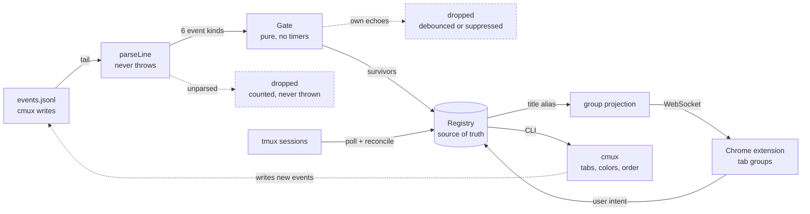

# metamux

> [!NOTE]
> **The metaharness multiplexer.** One daemon makes your tmux sessions, cmux tabs, and real-Chrome
> tab groups three projections of the same thing. It works by tailing an append-only event log
> cmux already writes, folding each line into a workspace registry, and driving two actuators from
> the result. Nothing patches cmux, and nothing polls: the seam is a documented event stream and a
> CLI.
>
> **The one idea to take away:** identity is content-addressed, not stored. A tmux session and a
> cmux tab are linked because they hash to the same title alias, not because anything holds a
> foreign key between them.

## At a glance

| Piece | Lives in | What it does |
|---|---|---|
| **Daemon** (`metamuxd`) | `daemon/src/` | Tails the cmux event log, owns the registry, drives both actuators. Bun, zero runtime deps. |
| **Chrome extension** | `extension/` | MV3. Applies group ops over a local WebSocket, reports user intent back. |
| **CLI** | `cli/metamux.ts` | `open`, `current`, `focus`, `status`, `config`, `doctor`, plus the stdio MCP server. |
| **Shell integration** | `shell/` | The `t` session picker, remote auto-attach, daemon ensure, tmux navigation binds. |
| **Opener** | `opener/` | A default-browser shim so cmd-clicked links route into the right group. |
| **Menubar** | `layout/` | Event-driven SwiftBar item, no polling. |

**Contract:** `docs/protocol.md`. Change it first, code second.
**History:** `BUILD-STATUS.md`. **Tests:** `bun test` (735, TDD).

---

## One event, traced end to end

Start here. Everything else in this README is detail hanging off this path.

**1. cmux writes a line.** You rename a tab. cmux appends this to `~/.cmuxterm/events.jsonl`
(real line, trimmed):

```json
{
  "category": "workspace",
  "name": "workspace.action",
  "workspace_id": "0E4F0000-40B2-4E78-9CB4-9D326A4D5E95",
  "boot_id": "25A6B286-55DB-499A-952F-11A698B4C04C",
  "seq": 1401,
  "occurred_at": "2026-08-25T15:48:01.145Z",
  "payload": { "params": { "action": "rename", "title": "compliance" } }
}
```

Note the shape: a rename is **not** `workspace.renamed`. It arrives as `workspace.action` with a
`params.action` discriminator. `workspace.renamed` exists in the vocabulary and has never once
appeared in live data. Read the log before trusting an event name.

**2. `parseLine` normalizes it.** `daemon/src/parser.ts` turns that into one internal event, or
returns `null`. It never throws, so a malformed line, an unknown category, or a future cmux
version costs one counter increment and nothing else.

```ts
{ name: "renamed", workspaceId: "0E4F0000-…", title: "compliance", seq: 1401, … }
```

**3. The Gate decides whether to act.** `daemon/src/gate.ts` is pure and holds no timers: you feed
it timestamped events and poll it with a clock. Renames pass straight through. Only
`selected` is debounced or dropped (see [The three guards](#the-three-guards)).

**4. The Registry binds it to a ref.** `daemon/src/registry.ts` matches by `(source, sourceId)`,
then by `(title, cwd)` among refs of the *same source*, then creates. The ref is the durable
identity, and it is never deleted, only archived:

```
mw_a5c6bf36   source=cmux   sourceId=9E1268B3-…   title=compliance
```

**5. Meanwhile tmux is its own source.** `daemon/src/tmux-source.ts` sees session `$4` named
`compliance` and produces a *second, separate* ref:

```
mw_4290d7c7   source=tmux   sourceId=$4   title=compliance
```

**6. Projection links them.** This is the step people miss. `daemon/src/group-projection.ts`
hashes the title and both refs collapse onto one canonical actuator identity:

```
titleAliasId("compliance") = "t_" + fnv1a32("compliance").toString(16).padStart(8, "0")
                           = t_0faa4b2a
```

Verify it yourself against the daemon log: `cmux` → `t_b58636d0`, `compliance` → `t_0faa4b2a`,
`mh-accounts` → `t_159573c3`. Those `t_` ids are what appear in `daemon.log` and in every
`POST /open` response.

**7. The extension applies it.** The daemon pushes `workspace.upserted` over the WebSocket; the
extension ensures one Chrome tab group named `compliance`, colored to match the cmux tab.

**The point:** the tmux session and the cmux tab are linked by a hash of a shared title. The
Registry keeps full per-workspace fidelity; only the projection collapses it. Rename the session
and both refs move buckets together, because both titles changed.

---

## The identity model

Six kinds of id touch a single workspace. Knowing which is stable across what is most of
debugging this system.

| Id | Example | Issued by | Stable across |
|---|---|---|---|
| tmux session id | `$4` | tmux | renames; **not** a server restart |
| cmux workspace UUID | `9E1268B3-…` | cmux | the cmux boot; **not** a restart |
| metamux ref | `mw_a5c6bf36` | metamux | forever, once created |
| title alias | `t_0faa4b2a` | derived (FNV-1a of title) | as long as the title is the same |
| Chrome group id | integer | Chrome | the browser session |
| `$CMUX_WORKSPACE_ID` | `9E1268B3-…` | cmux, into the shell env | the pane's lifetime |

Two consequences worth internalizing:

- **The alias is derived, never stored.** Two workspaces with the same title *are* one group, by
  construction. That is the feature (a tmux session and its cmux tab unify) and the sharp edge
  (two unrelated tabs named `Terminal 1` also unify).
- **`$CMUX_WORKSPACE_ID` is what makes an agent's link land in the right place.** Every opener
  reads it: no id means the daemon falls back to the visually active workspace, and every agent's
  links pile into one group. See [Gotchas](#gotchas).

---

## The pipeline



The dashed edge at the bottom is the one that shapes the design: driving cmux makes cmux log what
it was told to do, so metamux reads its own footprints one tick later. Every guard below exists
because of that loop.

### The three guards

| Guard | Value | What it prevents |
|---|---|---|
| **Cursor** `(bootId, seq)` | `cursor.json` | Replaying history on startup re-opening a week of tabs. Events at or below the cursor update state and emit nothing. |
| **Debounce** | 200 ms | Flicking through five tabs actuating five times instead of once, at the destination. |
| **Created-suppression** | 500 ms | cmux auto-selects a tab the moment it is created. Since metamux creates tabs, that select is its own echo; acting on it yanked the window every time a session spawned in the background. |

---

## Going deeper

<details>
<summary><b>Events we consume</b>: 6 of the 42 names cmux emits</summary>

Everything is `category: "workspace"` except the last row.

| On the wire | Reaction |
|---|---|
| `workspace.created` | Upsert a ref, tell Chrome to make the group. Arms the suppression window. |
| `workspace.selected` | Set `activeId`, show that group in the paired Chrome window in about 250 ms, without stealing focus. Debounced. |
| `workspace.action` → `rename` | Refresh title and cwd. Real renames arrive here. |
| `workspace.action` → `set_color` / `clear_color` | Resolve the value (a hex, or a named slot from `cmux.json`) and repaint the group. |
| `workspace.closed` | Archive the ref. Never delete, so a workspace that returns keeps its identity and color. |
| `window.focused` (`category: "window"`) | Follow the person between monitors. Live tail only, never replayed. |

Everything else is skipped in silence and counted in `skippedLines`. cmux emits 42 distinct names
across 9 categories; the `agent.hook.*` family (`PreToolUse`, `Stop`, `PermissionRequest`, …) is
the richest one metamux does not use yet.

</details>

<details>
<summary><b>The reverse direction</b>: how user intent gets back in</summary>

Chrome reports intent on the same WebSocket. These are what stop the daemon from fighting the
person using it.

| Frame | What the person did | Reaction |
|---|---|---|
| `userActivatedGroup` | Clicked a tab group | Switch cmux to match. Off by default. Guarded twice: the extension ignores group activity for 1500 ms after any server-driven activate, and the daemon ignores a frame naming the already-active workspace. |
| `userClosedGroup` | Closed a managed group | Clear the attachment and stop reconciling it. Closing means "done with this", not "rebuild it". |
| `groupPlacement` | Dragged a group to another window | Record the override instead of dragging it back. |
| `windowPairing` | Opened work on a second monitor | Persist the cmux-window to Chrome-window pairing, re-sync every client. |
| `state` | Nothing, the janitor reports | Log foreign groups found and deliberately left alone. |

</details>

<details>
<summary><b>tmux as a second source</b>: reconcile, partition mode, and idempotent spawns</summary>

`tmux-source.ts` polls tmux, `tmux-reconcile.ts` is a pure diff, `cmux-actuator.ts` is thin CLI
wrappers with no business logic: `spawnTab`, `retitleTab`, `reattachTab`, `setTabColor`,
`reorderTabs`, `closeTab`.

**Partition mode** (default) keeps exactly one cmux tab per session, spawned in whichever cmux
window you are focused on. Chrome windows pair 1:1 with cmux windows via per-window marker tabs,
so two monitors each run a matched cmux + Chrome pair and switching in one never disturbs the
other.

**A timeout is not a failure.** When cmux restarts, the CLI stops answering before the event
stream notices. Spawn calls time out, the reconciler retries, and some of the timed-out calls had
actually landed. That produced duplicate tabs on 2026-08-28. If you extend the actuator, make the
write idempotent or reconcile against real state afterward.

</details>

<details>
<summary><b>Colors</b>: palette allocation and hue-first mapping</summary>

Sessions claim colors from an ordered palette whose first nine entries are the nine distinct
Chrome group colors, so under ten open groups nothing is ambiguous. Colors free on close.

metamux paints each cmux tab with the exact Chrome swatch hex its group displays, so both sides
show the same color. Set a color yourself in cmux and it wins everywhere.

Mapping a cmux color to one of Chrome's nine is **hue-first, not nearest-RGB**: a desaturated navy
is blue to a person even when the math says grey.

</details>

<details>
<summary><b>Ports</b>: the one place metamux polls instead of listens</summary>

Dev-server ports are the one thing the log does not carry. `cmux rpc workspace.current` every 4 s,
diffing the active workspace's `listening_ports`, then three guards in order:

1. **Baseline on first sight.** The first poll of a workspace only records. Only a port that
   appears on a *later* poll is a candidate.
2. **Ephemeral cutoff.** Ports above `maxPort` (49151) are shown but never auto-opened.
3. **Per-cycle cap.** At most two auto-opens per cycle; the rest are logged.

All three came from one live failure: the first version noticed 28 already-open ports and opened
28 tabs. "A server started while I was watching" and "a server exists" are different facts.

Startup does one other ask: `set_color` from before the daemon was watching was never logged, so
it queries cmux for every workspace's current color and applies it in one pass.

</details>

<details>
<summary><b>Agents</b>: MCP tools, the URL hook, and the SSRF gate</summary>

Wired for Claude Code, Codex, and Grok. Any agent gets `metamux_current` / `metamux_workspaces`
(where am I, what exists), `metamux_open` (put a URL in my group), `metamux_tab_context`, and
workspace-scoped browser automation (`metamux_browser_snapshot` / `_screenshot` / `_navigate` /
`_click` / `_type`) via `chrome.debugger`, fenced to the calling workspace's group behind a
fail-closed SSRF gate (`agentBrowser`: off / read / full, default read).

`metamux_open` and the CLI both default to the **calling shell's** workspace, not the visually
active one, so an agent's link lands where it is working. Pass `active: true` / `--active` for the
other behavior.

A PostToolUse hook in each harness auto-opens GitHub PR and compare URLs from any shell output
into that session's group.

</details>

---

## Where to look in the code

| Reading for | Start at |
|---|---|
| How a log line becomes an event | `daemon/src/parser.ts` |
| Why an event did or did not actuate | `daemon/src/gate.ts` (pure, fully unit-testable) |
| Identity, binding, archival | `daemon/src/registry.ts` |
| Why two things share a group | `daemon/src/group-projection.ts` |
| What we tell Chrome | `docs/protocol.md`, "Wire protocol" |
| What we tell cmux | `daemon/src/cmux-actuator.ts` |

Skim rather than read: `main.ts` is wiring, and the `install-*.sh` scripts are mechanical.

---

## Setup

```
./install.sh              # shell + menubar + opener + launchd-render
./install.sh --only shell # or one step at a time
```

Every step is idempotent, so re-running after a `git pull` is how you update. The installer never
starts a daemon, loads the LaunchAgent, or changes your default browser; it prints those as
explicit follow-ups.

1. **Shell + tmux** (`scripts/install-shell.sh`): copies `shell/metamux.zsh` and
   `shell/metamux.tmux.conf` into `~/.config/metamux/shell/`, then points one marker block in
   `~/.zshrc` and one in `~/.tmux.conf` at those copies. Edit the repo files and re-run the
   installer; see [Gotchas](#gotchas) for why it copies.
2. **Daemon**: auto-ensured by the shell block in every cmux shell (`scripts/ensure-daemon.sh`).
   Manual start is `bun run daemon` from a cmux shell, since socket features need cmux's env.
3. **Extension**: `chrome://extensions` → Developer mode → Load unpacked → `extension/`. In its
   Options: port `8377`, secret from `bun cli/metamux.ts secret`, Test connection, Save.
4. **Harness wiring**: Claude Code (`claude mcp add` + settings.json hook +
   `~/.claude/skills/metamux`), Codex (`~/.codex/config.toml` MCP + hook, `~/.codex/skills`), Grok
   (`grok mcp add`, `~/.grok/hooks/metamux-url-hook.json`, `~/.grok/skills`). Codex and Grok
   trust-gate user hooks: approve "metamux URL auto-open" once.
5. **Link routing** (optional): see below.

### Shell integration

`shell/metamux.zsh` is the single zsh entry point.

- `t` opens the fzf session picker: arrows browse, live pane preview, Enter attaches, a typed name
  that does not exist gets created, `r` renames, `d` kills. Falls back to a numbered menu with no
  fzf.
- `t <name>` jumps to that session and runs Claude in it.
- `METAMUX_SPAWN_CWD` sets where new sessions start (default `~/Documents/GitHub`).
- SSH and mosh logins drop straight into the picker. The `-t 0` / `-t 1` guards keep invisible
  `zsh -ic` probes from hanging on it.

`shell/metamux.tmux.conf` holds F1/F2/F3 navigation, F4 jumpnav, the Left-arrow picker popup for
phone clients, and `update-environment CMUX_WORKSPACE_ID`. Its popup runs `zsh -ic _tmux_pick`, so
the `~/.zshrc` source line must stay unconditional for interactive shells. Prefix, copy-mode,
theming, and TPM stay in your own `~/.tmux.conf`.

### CLI

```
metamux open <url> [--active]  # open in the calling shell's workspace group
                               # (--active: the visually active workspace instead)
metamux current        # this shell's workspace (JSON)
metamux focus          # bring the paired Chrome window forward
metamux status|state   # daemon health / full registry
metamux config [--json | <key> <value>]   # view/set config, hot-reloads live
metamux prune          # drop archived workspaces from the registry
metamux doctor         # replay recent cmux events, show what would happen
metamux secret|mcp     # extension secret / stdio MCP server
```

Config lives at `~/.config/metamux/config.json`; every key is in `metamux config` and the menubar.
Notables: `groupBy` (title), `createGroups` (on-open), `colorMode` (palette), `agentBrowser`
(read), `reverseSync` (false), `janitor` (true), `tmux.mirror` (partition), `ports.mode` (auto),
`pruneArchivedAfterDays` (7).

<details>
<summary><b>Link routing</b>: making cmd-clicked links land in the right group</summary>

cmux has no built-in link-handler setting: a cmd-click in a cmux terminal goes through plain macOS
default-browser handling. `metamux-opener` (`opener/metamux-opener.swift`) makes metamux the
default browser instead. It is a tiny LSUIElement app (no Dock icon, no window) that registers for
http/https URL events and routes each one to `metamux open` when the frontmost app was cmux, else
straight through to Chrome. Full decision table in `docs/protocol.md`, "Link routing".

```
bun scripts/install-opener.sh                                                # compile + bundle + sign
~/Applications/metamux-opener.app/Contents/MacOS/metamux-opener --register   # make it default
```

`--register` requests the change via `LSSetDefaultHandlerForURLScheme`; macOS shows its own
confirmation dialog. If no dialog appears (varies by macOS version), set it manually in **System
Settings → Desktop & Dock → Default web browser**.

Verify either branch without touching the real default browser:

```
metamux-opener --test cmux https://example.com          # forces the cmux branch
metamux-opener --test passthrough https://example.com   # forces the passthrough branch
```

</details>

---

## Gotchas

These cost real debugging time. Each one is a constraint of the surrounding system, not a bug in
metamux.

**The dotfiles point at `~/.config`, not at the repo.** macOS gates `~/Documents` behind a TCC
grant the tmux server does not inherit, so a shell started inside tmux cannot read anything under
it. A `~/.zshrc` that sourced straight out of a repo living there printed `operation not permitted`
in *every tmux pane*. The installer copies and substitutes `__METAMUX_REPO__` the way
`install-launchd.sh` templates the plist.

**That TCC grant is inherited, and inheritance goes stale.** Access resolves through the
responsible-process chain: a tmux server spawned from a cmux tab inherits cmux's grant. A server
that outlives the cmux process that spawned it eventually falls back to each binary's own identity,
and Claude Code's grant is recorded *per version binary*, so a fresh auto-update has none. Symptom:
`getcwd: cannot access parent directories` and agents refusing to start. Fix: restart the tmux
server from a cmux tab. Test from *outside* tmux, or your probe inherits the denial you are trying
to measure.

**A pane needs `$CMUX_WORKSPACE_ID` or every link pools in one group.** Panes normally get it
because metamux creates each session via `cmux new-workspace --command "tmux new -A -s <name>"`,
and `new-session` copies the creating client's environment. A tmux-resurrect restore recreates
sessions outside that path, so the id is never planted: every tmux *client* still has the right
distinct id, but no *pane* does. `set -ga update-environment CMUX_WORKSPACE_ID` (in the tmux
fragment) makes tmux refresh it from the attaching client.

**The socket is `cmuxOnly`.** The cmux CLI authenticates on the environment a cmux-spawned shell
inherits, so a launchd- or cron-started process cannot drive cmux no matter what it passes. The
daemon degrades to tail-only and says so rather than failing.

---

## Debugging

- Marker tab shows connection status and workspaces; service-worker console via
  `chrome://extensions`.
- `bun scripts/fake-extension.ts` watches the event stream without Chrome.
- `metamux doctor`, `metamux status`, `~/.local/state/metamux/daemon.log`.
- Every activation step (tmux cutover, partition) has a documented rollback in `BUILD-STATUS.md`.
- `scripts/e2e-chromium.ts` is a fully isolated real-Chromium e2e with its own daemon, port, and
  state. It still tails the real events log, so background cmux activity can flake assertions; run
  it when the machine is quiet.

## Known gaps

- Reverse sync and detach-on-close watchers are single-window; they do not fire for groups living
  in secondary paired windows.
- Janitor cross-window recovery does not distinguish a window-split leftover from a deliberate
  `placementOverride` on fresh boot.
- The registry accumulates archived refs between prunes (auto-compact covers older than 7 days).
- Chrome shows its "debugging this browser" banner during automation operations. API-inherent.

## Where this is going

metamuxd is deliberately a metaharness kernel: sources and actuators plug into the same registry
and bus. The PRD roadmap, in order:

1. **Env actuator.** Each workspace optionally binds an isolated environment (OrbStack,
   devcontainer, cmux remote workspaces) with ports forwarded to the host, so the real browser
   keeps real passkeys.
2. **Automations.** An automation is a registry entry with a trigger: bus subscriptions
   (cmux/GitHub/Linear/Slack via a webhook feed), a small scheduler, incident dedupe with
   acknowledge-to-silence, and draft-only outward actions.
3. **Factory workers.** Persona workers (lens + harness config + entry/exit events + craft memory)
   composed into gated pipelines fed by tickets; bounded retry then human handback. Responsibility
   never transfers.
4. **Chief-of-staff / multiplayer.** A project-scoped standing bot owning shared, versioned,
   attributed, redactable context and that project's factory.
5. **Optional custom shell.** Only if cmux's limits ever bite. The kernel, extension, and actuators
   all carry over by swapping one source adapter.

Personal project by @zjdonhauser, built with Claude. Private until it proves itself.
